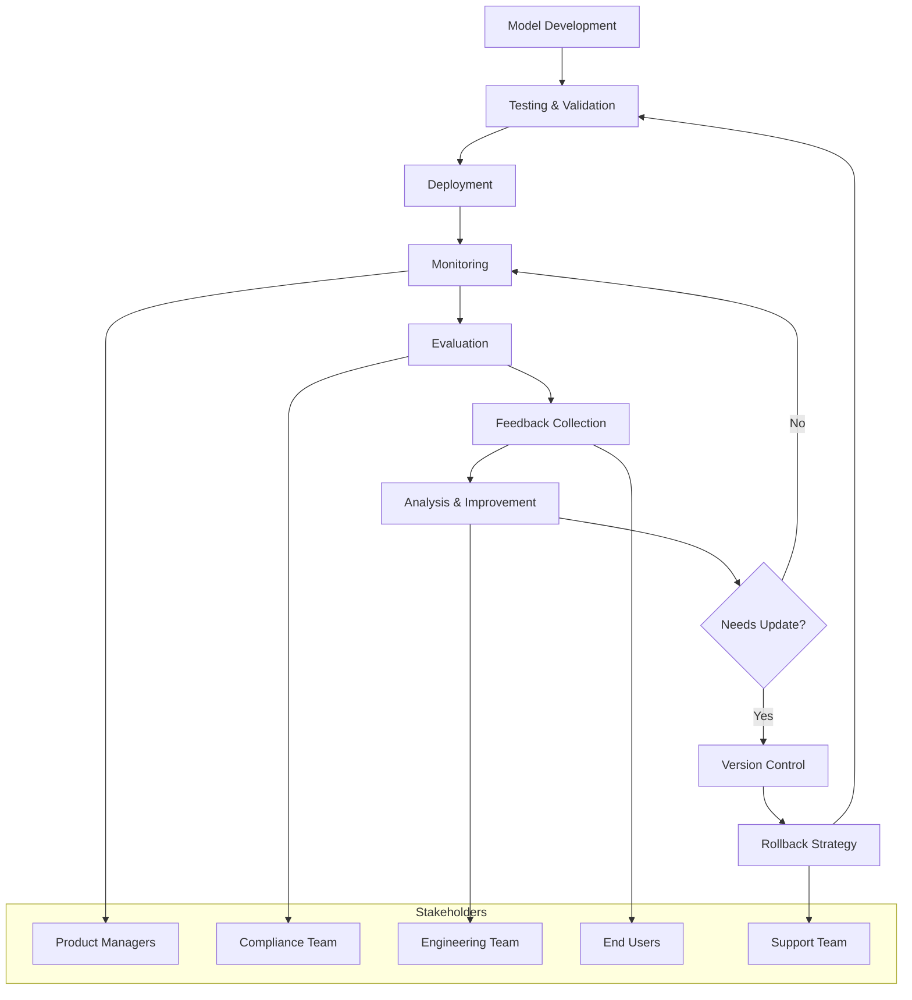

# LLMOps Lifecycle Map

## Overview
This document outlines the complete LLMOps lifecycle for our customer-facing chatbot, showing how each phase contributes to safe, reliable, and continuously improving AI applications.

## Lifecycle Diagram

## Phase Descriptions

### 1. **Model Development** 🧠
**Stakeholders:** AI/ML Engineers, Data Scientists
**Purpose:** Initial model training, prompt engineering, and base functionality development
**Key Activities:** Model selection, prompt optimization, initial testing
**Duration:** 2-4 weeks for major updates

### 2. **Testing & Validation** 🧪
**Stakeholders:** QA Engineers, Compliance Team, Product Managers
**Purpose:** Comprehensive testing including safety, bias, and performance validation
**Key Activities:** Unit tests, integration tests, safety evaluations, compliance checks
**Duration:** 1-2 weeks per release cycle

### 3. **Deployment** 🚀
**Stakeholders:** DevOps Engineers, Site Reliability Engineers
**Purpose:** Safe, controlled release of the chatbot to production environments
**Key Activities:** Blue-green deployment, canary releases, infrastructure provisioning
**Duration:** 2-3 days for standard deployments

### 4. **Monitoring** 📊
**Stakeholders:** SRE Team, Engineering Team, Product Managers
**Purpose:** Real-time tracking of system health, performance, and user interactions
**Key Activities:** Error tracking, latency monitoring, PII detection, usage analytics
**Duration:** Continuous, 24/7 monitoring

### 5. **Evaluation** 📈
**Stakeholders:** Product Managers, Data Analysts, Compliance Team
**Purpose:** Systematic assessment of chatbot performance against business and safety metrics
**Key Activities:** Response quality scoring, user satisfaction analysis, compliance audits
**Duration:** Weekly evaluation cycles with monthly deep-dives

### 6. **Feedback Collection** 💬
**Stakeholders:** End Users, Customer Support, Product Managers
**Purpose:** Gather user insights and identify improvement opportunities
**Key Activities:** User surveys, support ticket analysis, direct feedback collection
**Duration:** Continuous collection with weekly aggregation

### 7. **Analysis & Improvement** 🔍
**Stakeholders:** Data Scientists, Product Managers, Engineering Team
**Purpose:** Transform feedback and metrics into actionable improvements
**Key Activities:** Root cause analysis, A/B test design, improvement prioritization
**Duration:** 1-2 weeks per improvement cycle

### 8. **Version Control & Rollback** 🔄
**Stakeholders:** Engineering Team, DevOps, Site Reliability Engineers
**Purpose:** Manage model versions and provide rapid rollback capabilities for incidents
**Key Activities:** Model versioning, deployment automation, rollback procedures
**Duration:** Immediate rollback capability, planned updates on 2-week cycles

## Success Metrics

- **Response Quality:** >90% user satisfaction
- **System Reliability:** 99.9% uptime
- **Privacy Compliance:** 0 PII leak incidents
- **Response Time:** <2 seconds average
- **Rollback Time:** <5 minutes to stable version

## Risk Mitigation

- **Data Privacy:** Automated PII detection and redaction
- **Model Drift:** Continuous monitoring and evaluation
- **System Failures:** Automated rollback triggers
- **Compliance:** Regular audits and documentation
- **User Safety:** Content filtering and escalation procedures